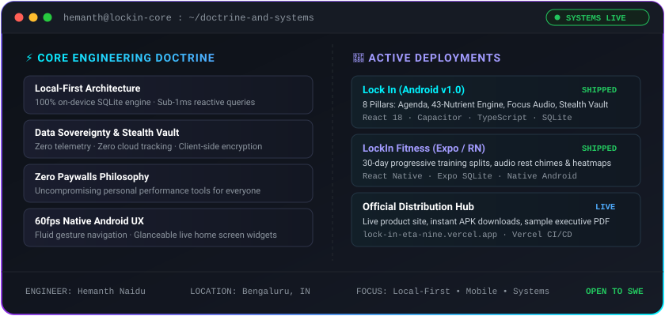
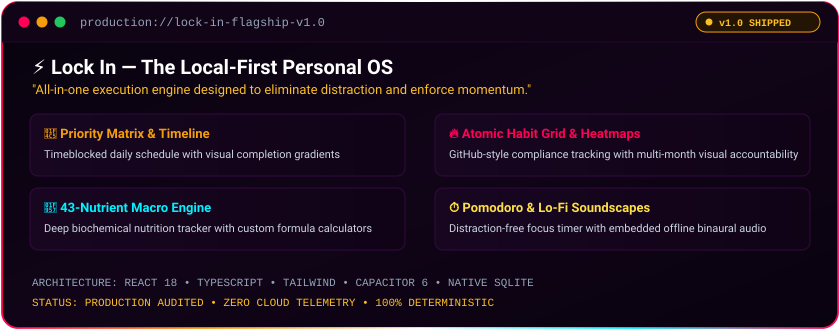
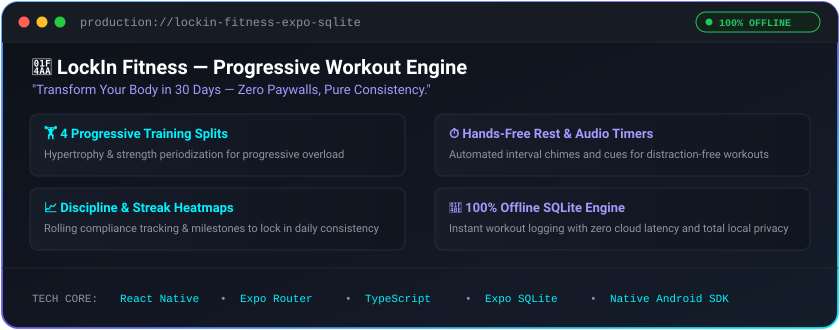
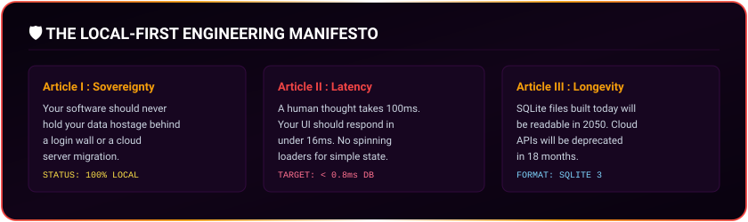
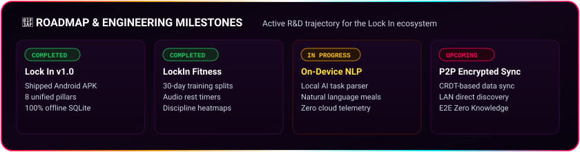

<!-- ==================== TOP BANNER (KEPT EXACTLY AS REQUESTED) ==================== -->

<!-- ==================== DYNAMIC TYPING SVG ==================== -->

  

<!-- ==================== QUICK ACTION NAVIGATION ==================== -->
&nbsp;
&nbsp;
&nbsp;
&nbsp;

 

---

## ⚡ Engineering Identity & Core Doctrine

  

&nbsp;
&nbsp;
&nbsp;

---

## 🛠️ Technology Arsenal

<a href="https://skillicons.dev">
  
   
  
</a>

  

| Domain | Mastered Technologies |
| :--- | :--- |
| **Languages** | `TypeScript`, `JavaScript (ESNext)`, `Python 3`, `SQL (PostgreSQL / SQLite)`, `HTML5 / CSS3` |
| **Mobile & Native** | `Android SDK`, `Capacitor`, `React Native / Expo`, `SQLite Engine`, `Launcher Widgets` |
| **Frontend Engineering** | `React 18`, `Tailwind CSS`, `Vite`, `Web Audio API`, `Client-Side PDF Generation` |
| **Backend & Persistence** | `Node.js`, `Express.js`, `PostgreSQL`, `Prisma ORM`, `RESTful Microservices` |
| **DevOps & Tooling** | `Git`, `GitHub Actions`, `Postman`, `Android Studio`, `Vercel CI/CD` |

---

## 📱 Flagship System 01 — Lock In

  

&nbsp;
&nbsp;
&nbsp;

  

<!-- MOBILE UI GALLERY -->
<table>
  <tr>
    <td align="center" width="25%">
       
      <b>📅 Today Agenda</b>
    </td>
    <td align="center" width="25%">
       
      <b>🔥 Atomic Habits</b>
    </td>
    <td align="center" width="25%">
       
      <b>🥗 43-Nutrient Engine</b>
    </td>
    <td align="center" width="25%">
       
      <b>⏱️ Focus & Soundscapes</b>
    </td>
  </tr>
</table>

---

## 💪 Flagship System 02 — LockIn Fitness

  

&nbsp;

---

## 🛡️ The Local-First Manifesto

---

## 📊 Analytics & Code Cadence

&nbsp;

  

---

## 🎯 Roadmap & Engineering Milestones

---

## 🤝 Let's Connect & Collaborate

I am actively open to **Software Engineering Roles**, **Full-Stack / Mobile Engineering positions**, and ambitious collaborations!

 

&nbsp;&nbsp;

&nbsp;&nbsp;

  

> *"Master the 1% standard — building at the intersection of productivity, systems & performance."*

 

